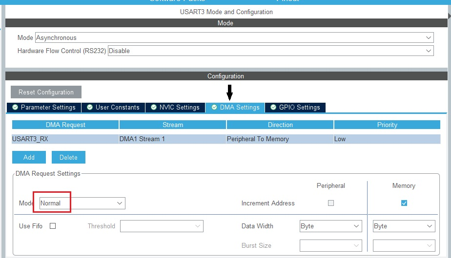
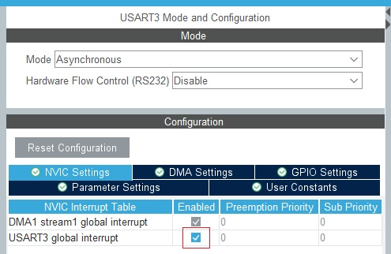

# Nextion-STM32-Library
Library for using Nextion HMI displays on STM32 MCUs with STM32Cube and C++ HAL based projects.

# Introduction
This library needs C++ version 11 or higher and works with STM32Cube projects using HAL libraries and depends on the "main.h" file created by STM32Cube software. Inclusion of "main.h" file makes this library compatible for all STM32 microcontroller families as long as the project is created with STM32Cube with HAL libraries selected. 

#### How to create C++ project in CubeIDE: [(see…)](#notes)

# Configuration
To properly use this library, a USART/UART peripheral of the MCU should be reserved to the Nextion display and configured in "Asynchronous" mode. For RX choose DMA with default settings as shown below:



The Global Interrupts should be activated in the STM32Cube IOC configuration:




# Usage

This library requires to be initialized in a few steps. Every code in this section is written in order, so you can follow this section as a step by step guide. 

First include the header library file in your project.

```cpp
#include "NDisplay.h"
```
In your main.h add one row, where 'hdma_usart3_rx' should be actual handle used by you for Nextion.

```cpp
/* USER CODE BEGIN ET */
extern DMA_HandleTypeDef hdma_usart3_rx;
/* USER CODE END ET */
```

Then, the user should create a Nextion object. 

```cpp
// Nextion library main object
NDisplay display;
```

Handles to objects (representing text, number, etc., on Nextion display) returns from method addComp.

Parameters: Page No., Id, Object Name, Callback Function On Press, Callback Function On Release
If you don't want any callback function drop last parameters (default: ***nullptr***).

```cpp
NComp nh = display.addComp(0, 1, "nh");
```

This library uses DMA and interrupt which are triggered by _Idle_ in serial receive.

Then you should to use special USART/UART Interrupt Callback function and include the _processRx_ function. This enables the library to interpret the received data. This part is copy pasteable but you need to change *USART3* to UART/USART you have chosen, and _display_ to your own Nextion object name. 

```cpp
void HAL_UARTEx_RxEventCallback(UART_HandleTypeDef *huart, uint16_t size)
    {
    // size bytes are now in display.RxData buffer
    if (huart->Instance == USART3)
        {
        display.processRx(huart, size);
        }
    }
```

You can also declare and define a callback function(s) for any Nextion components you want. 

But remember, you have not to use methods ***getVal(.)*** or ***getText(.)*** in body of the callback.

```cpp
void buttonCallback()
    {
    //Example function
    HAL_GPIO_TogglePin(LED_GPIO_Port, LED_Pin);
    }
```

In the main, after UART and DMA are initialized, next step is to bind UART handle to Nextion object.

```cpp
//Initialize Nextion with the configured UART handle and wait for Idle event
display.init(&huart3, &hdma_usart3_rx);

```

The code below shows a complete example with a component callback (only the functions which concern this library are included):

```cpp
#include "NDisplay.h"

// create Nextion object
NDisplay display;
// add component(s) you want, here with callback onPress
NComp button1 = display.addComp(0, 12, "button1", buttonCallback);

// define callback which handle Idle interrupt
void HAL_UARTEx_RxEventCallback(UART_HandleTypeDef *huart, uint16_t size)
    {
    if (huart->Instance == USART3) 
        {
        display.processRx(huart, size);
        }
    }   

// define callback for button1
void buttonCallback()
    {
    //Example function
    HAL_GPIO_TogglePin(LED_GPIO_Port, LED_Pin);
    }

int main()
    {
    display.init(&huart3, &hdma_usart3_rx);
    
    for(;;)
        {
        //Main loop
        }
    }   
```

## Component Functions

This library has four methods which can be used with the corresponding Nextion components:

### bool getText( std::string& txt ) const;

This function gets the text data of a Nextion Text component. 

Example Usage:
```cpp
name.getText(myBuf);

```

### void setText( const std::string& txt ) const;

This function sets the text data of a Nextion Text component. 

Example Usage:
```cpp
name.setText("Mary");

```

### bool getVal( int& v ) const;

This function gets the integer value (val property) of Nextion component. 

Example Usage:
```cpp
age.getVal(v);

```

### void setVal( int v ) const;

This function sets the val property of a Nextion component. 

Example Usage:
```cpp
age.setVal(23);

```

## Nextion object function

### void sendCommand( const std::string& _command ) const;
Example Usage:
```cpp
display.sendCommand("page 1");

```

### bool  getPageId( int& pId);
Example Usage:
```cpp
int pid;
bool res;
res = NComp::getPageId(pid);`
if (res)
   {
   // use pid ...
   }
```

**Note**: components functions are define for user convenience, all "set" commands could be executed via` `sendCommand`, it applies as well to other properties such colors etc.


### Buffers (Rx and Tx) have size of 96 bytes.

### Some loose structure, and especially this readme file is inspired of [Emre Dur](https://github.com/EmreDUR) library.


### Notes:
#### C++ project in STM32 CubeIDE
1.  Choose `C++` as targeted language when you create new project.
2.  In Project Manager/Code Generator check `Generate peripheral initialization as a pair of '.c/.h' files per peripheral`. This gives you better structure, but more important, all changes in these files need only re-compilation not editing.
3.  Rename your `main.c` file to `main.cpp` and you have a cpp project.
4.  If you have to change .ioc file and re-generate the code, you should delete new main.c file (if you change clock configuration or add some new features – copy clock settings or new features initialization from main.c before deletion).

<kris@jaxasoft.se>
